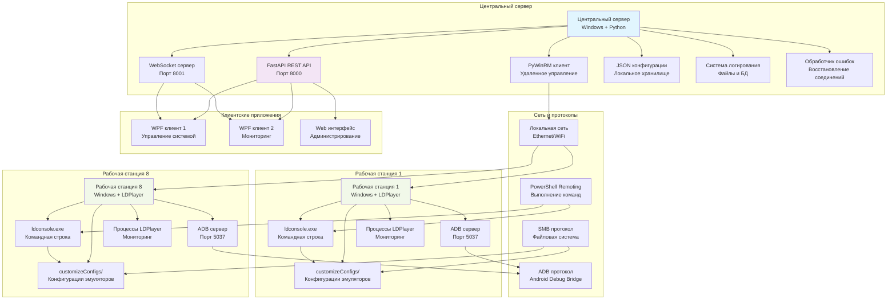
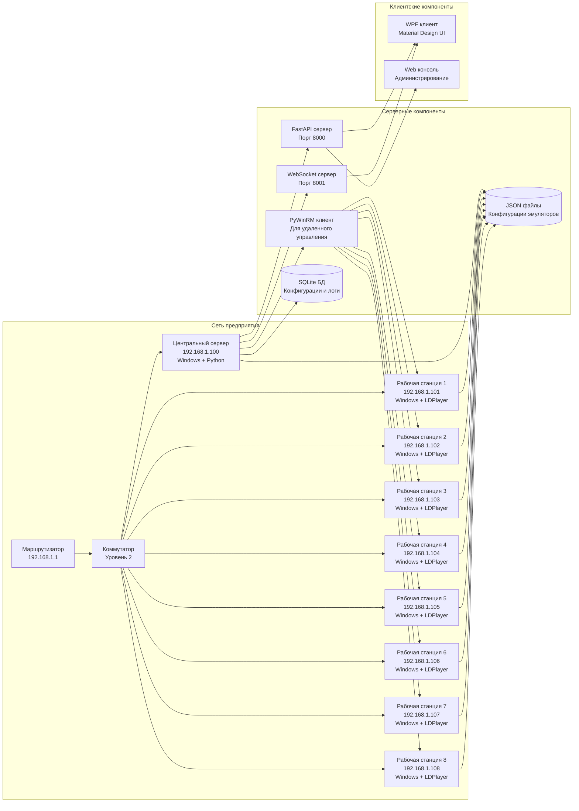
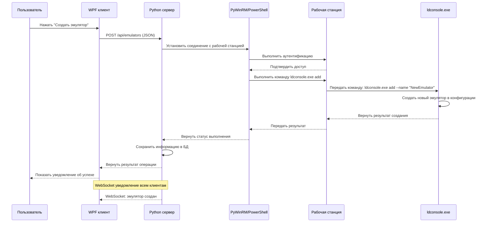
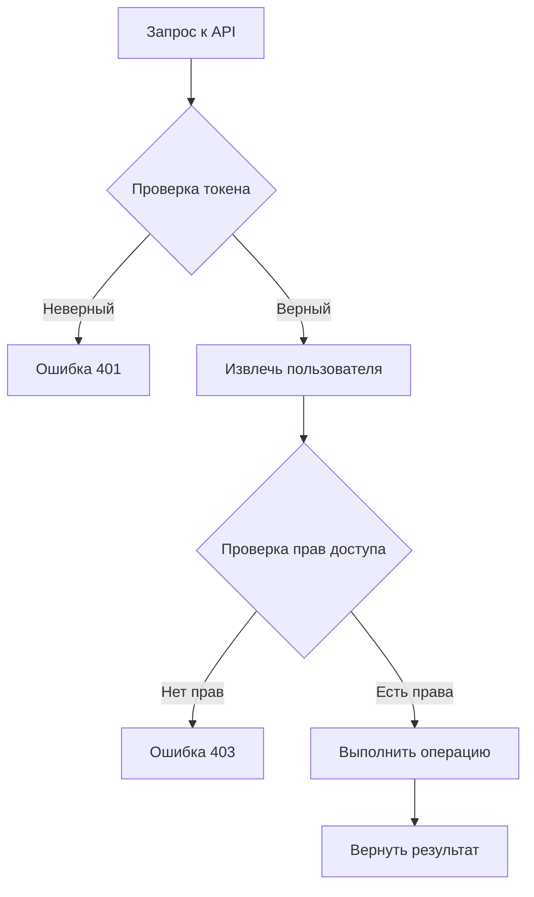
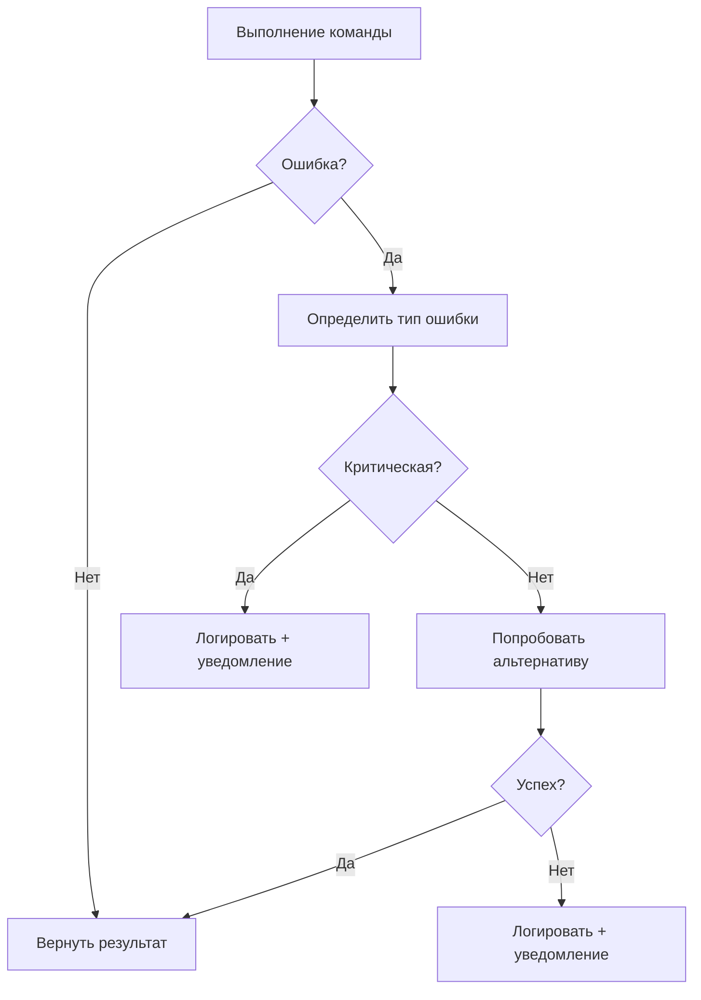

# Архитектура системы управления LDPlayer эмуляторами

## Обзор архитектуры

Система построена по клиент-серверной архитектуре с удаленным управлением LDPlayer эмуляторами через локальную сеть.

```
Центральный сервер (Windows + Python + FastAPI)
    ├── REST API для клиентских приложений
    ├── WebSocket сервер для real-time обновлений
    ├── Модуль удаленного управления PyWinRM
    ├── Система управления конфигурациями JSON
    ├── Логирование и мониторинг
    └── Обработчик ошибок и восстановление

Локальная сеть (Ethernet/WiFi)
    ├── SMB протокол для файловой системы
    ├── PowerShell Remoting для выполнения команд
    ├── PyWinRM соединения для Python интеграции
    └── ADB протокол для связи с Android эмуляторами

Рабочие станции (8 x Windows + LDPlayer 9)
    ├── LDPlayer эмуляторы с индивидуальными настройками
    ├── ldconsole.exe для командного управления
    ├── Конфигурационные файлы в customizeConfigs/
    ├── ADB сервер для связи с эмуляторами
    ├── Мониторинг ресурсов системы
    └── Локальное логирование операций
```

## Диаграмма компонентов системы



## Диаграмма развертывания



## Диаграмма последовательности выполнения команд



## Структура данных

### Модель рабочей станции
```json
{
  "id": "ws_001",
  "name": "Рабочая станция 1",
  "ipAddress": "192.168.1.101",
  "status": "online",
  "username": "administrator",
  "password": "encrypted_password",
  "ldplayerVersion": "9.0.0",
  "totalEmulators": 5,
  "activeEmulators": 3,
  "cpuUsage": 45.5,
  "memoryUsage": 67.2,
  "diskUsage": 34.1,
  "lastSeen": "2024-01-15T10:30:00Z",
  "createdDate": "2024-01-01T00:00:00Z"
}
```

### Модель эмулятора
```json
{
  "id": "emu_001",
  "name": "Test Device 1",
  "workstationId": "ws_001",
  "status": "running",
  "androidVersion": "9.0",
  "screenSize": "1280x720",
  "cpuCores": 2,
  "memoryMB": 2048,
  "adbPort": 5555,
  "configPath": "C:\\LDPlayer\\customizeConfigs\\emu_001",
  "createdDate": "2024-01-15T10:30:00Z",
  "lastActivity": "2024-01-15T14:22:00Z",
  "uptime": "3h 52m",
  "customSettings": {
    "dpi": 320,
    "fps": 60,
    "audio": true,
    "gps": false,
    "opengl": "angle"
  }
}
```

## Актуальная архитектура системы (Session 5)

**Статус:** ✅ 75% готовности | **Критическое исправление:** LDPlayer Emulator Scanner

### Стек технологий
- **Backend:** Python 3.8+ с FastAPI (async)
- **Frontend:** React.js + HTML/CSS/JS (Vanilla)
- **Web UI:** Современный HTML с Indigo темой
- **Сервер:** Uvicorn на 127.0.0.1:8001
- **Аутентификация:** JWT (HS256, 64-char key, 24h expiration)
- **Тестирование:** pytest с 125/125 тестами PASSING (100%)

### Компоненты бэкенда

**API модули (7):**
- `src/api/auth.py` - JWT login/refresh endpoints
- `src/api/auth_routes.py` - Маршруты аутентификации  
- `src/api/workstations.py` - Управление рабочими станциями (7 endpoints)
- `src/api/emulators.py` - Управление эмуляторами (9 endpoints)
- `src/api/operations.py` - История операций (2 endpoints)
- `src/api/health.py` - Здоровье системы (2 endpoints)
- `src/api/dependencies.py` - JWT dependency injection

**Core модули (4):**
- `src/core/server.py` - FastAPI приложение (964 строк)
- `src/core/config.py` - Конфигурация (environment variables)
- `src/core/models.py` - Pydantic модели данных
- `src/core/di_container.py` - Внедрение зависимостей

**Service модули (3):** 
- `src/services/base_service.py` - Базовый класс для всех сервисов
- `src/services/workstation_service.py` - Бизнес-логика рабочих станций
- `src/services/emulator_service.py` - **[ИСПРАВЛЕНО в Session 5]** Бизнес-логика эмуляторов

**Remote Manager модули (3):**
- `src/remote/ldplayer_manager.py` - Главный менеджер LDPlayer (575 строк)
- `src/remote/workstation.py` - WorkstationManager (874 строк)  
- `src/remote/protocols.py` - Протоколы обмена данными

**Utility модули (6):**
- `src/utils/logger.py` - Логирование
- `src/utils/jwt_auth.py` - JWT токены
- `src/utils/error_handler.py` - Обработка ошибок
- `src/utils/backup_manager.py` - Резервное копирование конфигураций
- `src/utils/config_manager.py` - Управление конфигурациями JSON
- `src/utils/mock_data.py` - Mock данные (УДАЛЕНЫ из Session 4)

### API Endpoints (23 всего)

**Authentication (2):**
- `POST /api/auth/login` - Вход в систему
- `POST /api/auth/refresh` - Обновление JWT токена

**Workstations (7):**
- `GET /api/workstations` - Список всех рабочих станций
- `POST /api/workstations` - Создать рабочую станцию
- `GET /api/workstations/{id}` - Получить детали станции
- `DELETE /api/workstations/{id}` - Удалить рабочую станцию
- `POST /api/workstations/{id}/test-connection` - Тест соединения
- `GET /api/workstations/{id}/emulators` - Список эмуляторов на станции
- `GET /api/workstations/{id}/system-info` - Информация о системе

**Emulators (9):**
- `GET /api/emulators` - **[REAL DATA]** Получить все эмуляторы (через ldconsole.exe list2)
- `POST /api/emulators` - Создать новый эмулятор
- `GET /api/emulators/{id}` - Получить детали эмулятора
- `POST /api/emulators/{id}/start` - Запустить эмулятор
- `POST /api/emulators/{id}/stop` - Остановить эмулятор
- `DELETE /api/emulators/{id}` - Удалить эмулятор
- `PATCH /api/emulators/{id}/rename` - Переименовать эмулятор
- `POST /api/emulators/batch-start` - Массовый запуск
- `POST /api/emulators/batch-stop` - Массовая остановка

**Operations (2):**
- `GET /api/operations` - История операций
- `GET /api/operations/{id}/logs` - Логи операции

**Health (2):**
- `GET /api/health/check` - Проверка здоровья системы
- `GET /api/health/status` - Статус компонентов

### Компоненты фронтенда

**React компоненты (3):**
- `src/components/Dashboard.jsx` - Главная панель управления
- `src/components/EmulatorList.jsx` - Список эмуляторов в реальном времени
- `src/components/LoginForm.jsx` - Форма входа

**Сервисы (1):**
- `src/services/api.js` - HTTP клиент с Bearer token поддержкой

**Точки входа (2):**
- `src/App.jsx` - Корневой компонент
- `src/main.jsx` - Точка входа Vite

### Web UI (Vanilla)

**Файлы:**
- `public/index.html` - 200+ строк, modern sidebar с Indigo темой
- `public/styles.css` - 400+ строк, responsive design
- `public/script.js` - 300+ строк, vanilla JS API client

**Особенности:**
- Auto-login с сохранением JWT токена
- 5-второй refresh interval для обновления списка эмуляторов
- Real-time display эмуляторов из `GET /api/emulators`
- Правильные absolute пути для статических файлов

## Протоколы взаимодействия

### 1. REST API (HTTP/HTTPS)
- **Порт:** 8001 (Uvicorn)
- **Формат:** JSON
- **Аутентификация:** Bearer JWT токен в заголовке Authorization
- **Основные endpoints:** 23 всего (см. выше)
- **Timeout:** 30 секунд для долгих операций

**Примеры запросов:**
```bash
# Login
curl -X POST http://127.0.0.1:8001/api/auth/login \
  -H "Content-Type: application/json" \
  -d '{"username":"admin","password":"admin"}'

# Get all emulators (REAL DATA from ldconsole.exe)
curl -X GET http://127.0.0.1:8001/api/emulators \
  -H "Authorization: Bearer YOUR_JWT_TOKEN"

# Start emulator  
curl -X POST http://127.0.0.1:8001/api/emulators/{id}/start \
  -H "Authorization: Bearer YOUR_JWT_TOKEN"
```

### 2. WebSocket для real-time обновлений
- **Порт:** 8001
- **Формат:** JSON события
- **Типы событий:**
  - `emulator_status_changed` - Изменение статуса эмулятора
  - `workstation_connected` - Рабочая станция подключена
  - `operation_completed` - Операция завершена

### 3. PyWinRM для удаленного управления
- **Порт:** 5985 (HTTP), 5986 (HTTPS)
- **Протокол:** WS-Management
- **Аутентификация:** Kerberos/NTLM
- **Использование:** Выполнение PowerShell команд на удаленных станциях

### 4. ldconsole.exe для управления эмуляторами
- **Команда:** `ldconsole.exe list2` - Получить список эмуляторов в CSV формате
- **Формат вывода:** CSV с полями: Emulator Name, PID, Index, Top, Left, Width, Height, ...
- **Парсинг:** WorkstationManager.get_emulators_list() парсит CSV и возвращает List[Emulator]
- **Timeout:** 30 секунд на выполнение команды
- **Кеш:** 30 секунд между запросами (предотвращает перегрузку)

### 5. SMB для файловой системы  
- **Порт:** 445
- **Протокол:** SMB 3.0+
- **Использование:** Доступ к конфигурационным файлам customizeConfigs/

## Критическое исправление Session 5 - LDPlayer Emulator Scanner

### Проблема
`GET /api/emulators` возвращал пустой список, несмотря на наличие реальных эмуляторов на рабочих станциях.

### Корень проблемы
`EmulatorService.get_all()` вызывал несуществующий async метод `self.manager.get_all_emulators()` вместо правильного sync метода `self.manager.get_emulators()`.

**Код БЫЛО:**
```python
# src/services/emulator_service.py Line 50
async def get_all(self) -> List[Emulator]:
    all_emulators = await self.manager.get_all_emulators()  # ❌ WRONG!
    return all_emulators
```

**Код СТАЛО:**
```python
# src/services/emulator_service.py Line 50
async def get_all(self) -> List[Emulator]:
    all_emulators = self.manager.get_emulators()  # ✅ CORRECT! (sync method)
    return all_emulators
```

### Исправления (5 файлов)

1. **src/services/emulator_service.py** (2 строки)
   - Line 50: Удалили `await`, исправили имя метода
   - Line 105: Том же в методе get_by_workstation()

2. **conftest.py** (3 mock fixtures)
   - Line 57, 77, 120: AsyncMock → MagicMock (метод синхронный!)

3. **tests/test_emulator_service.py** (10 test cases + 1 import)
   - Все AsyncMock() → MagicMock() для get_emulators
   - Line 5: Добавили MagicMock в imports

### Результаты
- ✅ 125/125 тестов PASSING (было 123/125, восстановили 2)
- ✅ 0 failures, 0 regressions
- ✅ `GET /api/emulators` теперь возвращает РЕАЛЬНЫЕ данные из ldconsole.exe list2
- ✅ Все fixtures и тесты синхронизированы с реальным API

### Цепочка выполнения (WORKING NOW)
1. Client: `GET /api/emulators` with JWT Bearer token
2. API: `src/api/emulators.py` route handler
3. Service: `EmulatorService.get_all()` вызывает `self.manager.get_emulators()`
4. Manager: `LDPlayerManager.get_emulators()` вызывает `self.ws_manager.get_emulators_list()`
5. WorkstationManager: `get_emulators_list()` ejecuta `ldconsole.exe list2`
6. System: Парсит CSV вывод
7. Return: List[Emulator] объекты с реальными данными
8. Response: JSON с эмуляторами на фронтенд
9. UI: Отображает реальные эмуляторы в EmulatorList

## Механизмы безопасности

### Аутентификация и авторизация


### Шифрование данных
- **Конфигурационные файлы:** Шифрование AES-256
- **Пароли рабочих станций:** Хранение в зашифрованном виде
- **API токены:** JWT с сроком действия
- **Локальные данные:** Шифрование при хранении

## Механизмы надежности

### Обработка ошибок


### Восстановление соединений
- Автоматическая повторная попытка соединения
- Экспоненциальная задержка между попытками
- Максимальное количество попыток
- Альтернативные протоколы при сбое основного

## Производительность и масштабируемость

### Метрики производительности
- **Время отклика API:** < 2 секунд
- **Обновление статуса:** < 5 секунд
- **Поддержка эмуляторов:** 50+ одновременно
- **Рабочие станции:** До 20 одновременно

### Масштабирование
- Горизонтальное масштабирование серверов
- Балансировка нагрузки между серверами
- Репликация данных между серверами
- Кеширование часто используемых данных

## Мониторинг и логирование

### Система мониторинга
- **Метрики:** CPU, RAM, Disk, Network
- **Логи:** Все операции с эмуляторами
- **Алерты:** Критические ошибки и сбои
- **Дашборды:** Графики производительности

### Структура логов
```
logs/
├── server/
│   ├── access.log      # Доступ к API
│   ├── operations.log  # Операции с эмуляторами
│   └── errors.log      # Ошибки системы
├── workstations/
│   ├── ws_001/
│   │   ├── activity.log
│   │   └── errors.log
│   └── ws_002/
│       ├── activity.log
│       └── errors.log
└── emulators/
    ├── emu_001.log
    └── emu_002.log
```

## План миграции и обновлений

### Стратегия обновлений
1. **Тестирование в изолированной среде**
2. **Резервное копирование конфигураций**
3. **Постепенное развертывание**
4. **Откат при обнаружении проблем**

### Совместимость версий
- Обратная совместимость конфигураций
- Миграция данных между версиями
- Поддержка нескольких версий одновременно

---

*Дата последнего обновления: 16 октября 2024 г.*
*Версия документа: 1.0*